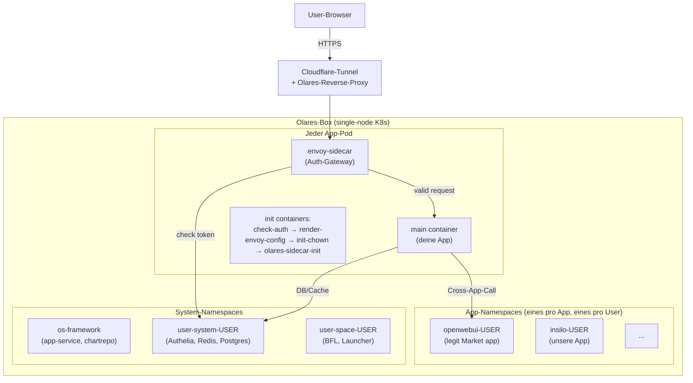
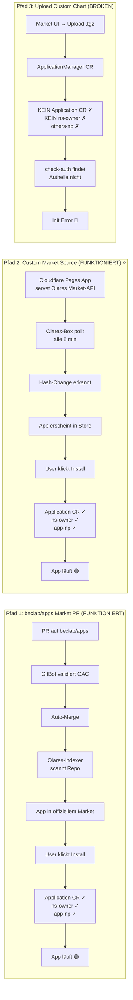
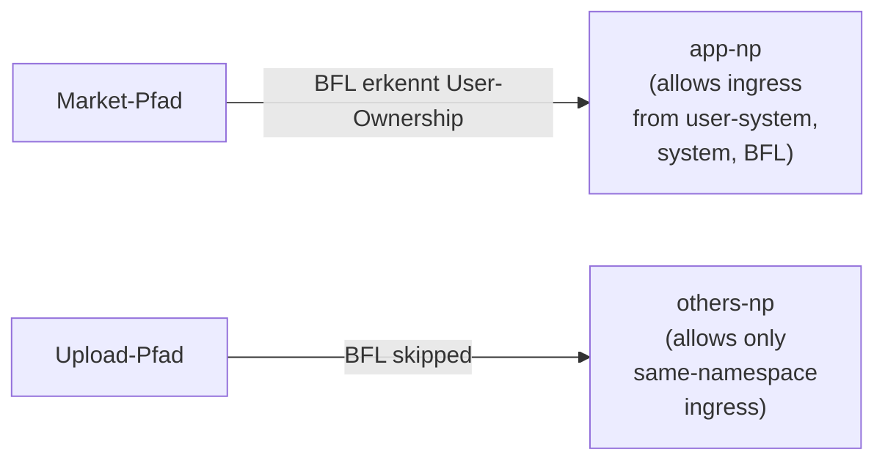
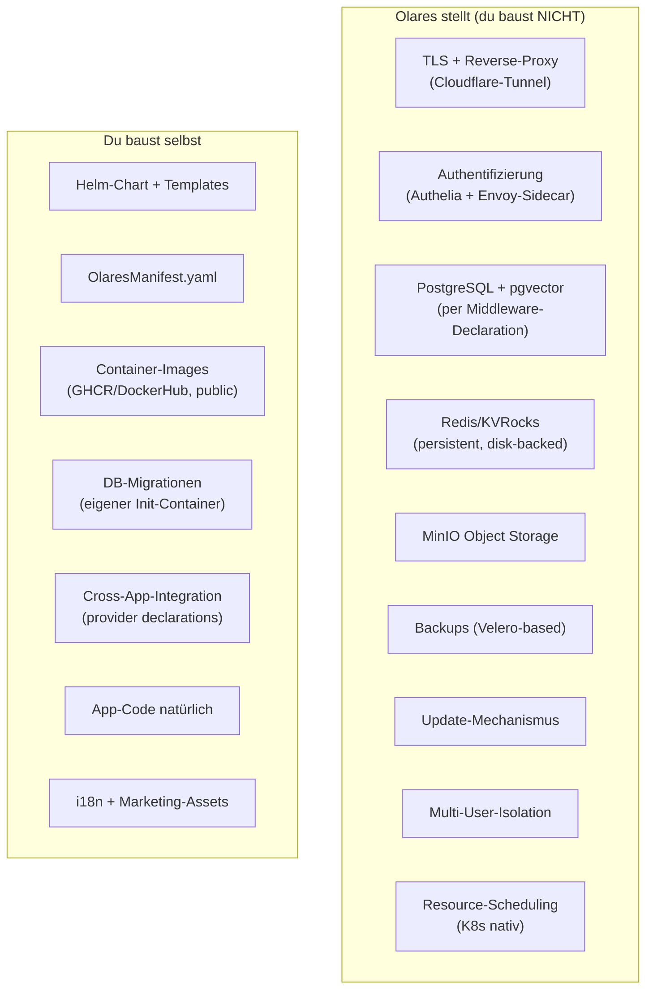

# Olares Deep Dive — wie es funktioniert, was es erwartet

> Stand: 13. Mai 2026, nach ~12h Hands-on-Debugging mit Insilo.
> Quelle: Olares 1.12, beclab/apps Repo-Konventionen, eigene Cluster-Inspektion.

Dieses Dokument ist die destillierte Substanz aus dem Phase-4-Debugging-Marathon
mit Insilo. Wer das hier liest, spart sich 10 Stunden Trial-and-Error.

---

## 1. Olares in 30 Sekunden

Olares ist **kein Linux mit Docker** — es ist ein **Kubernetes-basiertes
Betriebssystem**. Auf jeder Olares-Box läuft ein einzelner K8s-Cluster (single-node
typically), und ALLES — Auth, DB, Cache, deine App — sind Pods in diesem Cluster.

Der Witz: Olares versteckt K8s vor dem End-User. Der Kunde sieht „eine Box mit
Apps", nicht Pods und Deployments. Olares macht das via:

- **BFL** (Backend For Launcher) — Frontend-Aggregator + User-Identity
- **app-service** — installiert/managed Apps, rendert Helm-Charts
- **Authelia** — Single-Sign-On via Envoy-Sidecar pro App-Pod
- **System-Middlewares** — Postgres, Redis/KVRocks, MinIO, NATS als gemeinsame Services
- **Reverse Proxy** mit Cloudflare-Tunnel + Tailscale für TLS

Dein Job als App-Entwickler: **liefere ein Helm-Chart + ein OlaresManifest**, der
Rest macht Olares.

---

## 2. Architektur-Übersicht



**Vier Erkenntnisse aus dem Bild:**

1. **Eine App = ein Namespace.** `<appname>-<username>`.
2. **Eine Box kann mehrere User haben.** Jeder hat seine eigenen `user-system-<user>` und `user-space-<user>` Namespaces. Apps werden pro-User installiert.
3. **Jeder Pod kriegt einen Envoy-Sidecar** wenn die App `entrances` deklariert hat. Der Sidecar prüft jeden Request gegen Authelia.
4. **Cross-Namespace ist NetworkPolicy-restricted.** Apps reden mit user-system nur wenn ihre Namespace-Labels stimmen.

---

## 3. Namespaces — die zentrale Isolation

| Namespace-Typ | Beispiel | Wer | Was drin |
|---|---|---|---|
| **os-framework** | `os-framework` | Olares-System | `app-service-0` (Install-Engine), `chartrepo-deployment` |
| **os-platform** | `os-platform` | Olares-System | Cross-User-Shared-Services |
| **user-system-USER** | `user-system-kaivostudio` | Per User | Authelia, Postgres-Cluster, Redis/KVRocks, MinIO, BFL-User-Auth |
| **user-space-USER** | `user-space-kaivostudio` | Per User | BFL-Frontend, Launcher-UI, User-Web-Shell |
| **APP-USER** | `insilo-kaivostudio` | Per User per App | Deine App-Pods (frontend, backend, etc.) |

### Wichtige Namespace-Labels

| Label | Wer setzt | Wofür |
|---|---|---|
| `kubernetes.io/metadata.name` | K8s automatisch | Standard, gibt den NS-Namen wieder |
| `kubesphere.io/workspace` | KubeSphere-Integration | Workspace-Grouping (für uns immer `system-workspace`) |
| `bytetrade.io/namespace` | Olares | Identifies NS as Olares-managed |
| **`bytetrade.io/ns-owner`** | **Olares BFL bei Market-Install** | **Wer der App-Owner ist (Username). KRITISCH für NetworkPolicy.** |
| `bytetrade.io/ns-type` | Olares | `system`, `user-internal`, `user-space`, `app`, `others` |
| `bytetrade.io/ns-shared` | Olares (selten) | Gibt Cross-User-Zugriff frei |

**Das Olares-Geheimnis:** Die NetworkPolicies in user-system-USER erlauben Ingress
**ausschließlich** von Namespaces mit `ns-owner=<user>` ODER `ns-type=system` ODER
`ns-shared=true`. Wenn deine App diese Labels nicht hat, ist sie **isoliert** —
kein Authelia, kein Postgres, kein Redis.

---

## 4. App-Lifecycle: Drei Pfade — zwei funktionieren, einer nicht

Olares kennt **drei** Wege wie Apps auf eine Box kommen. Wir haben in der ersten Phase nur zwei davon gekannt — und die einzige funktionierende übersehen.



### Warum es drei Pfade gibt

- **Pfad 1 (beclab/apps PR):** für globale Distribution. Apps die jeder Olares-User
  weltweit finden soll. 1-2 Wochen Review-Zyklus. Olares-Team kuratiert.

- **Pfad 2 (Custom Market Source):** für **private Distribution**. Du hostest deine
  eigene Market-API auf Cloudflare Pages (oder beliebigem HTTPS-Server). Olares
  pollt deine URL alle 5 min, behandelt deine Apps gleichwertig wie offizielle.
  **Das ist der richtige Weg für proprietäre/private Apps**, weil:
  - Distribution-Hoheit beim Entwickler bleibt
  - Versions-Updates kommen automatisch auf alle abonnierten Boxen
  - Voller BFL-Flow → korrekte Labels, NetworkPolicy
  - Kein Olares-PR-Approval nötig

- **Pfad 3 (Upload custom chart):** Olares hat das als **Dev-Test-Feature** gedacht.
  Triggert nicht den vollen BFL-Provisioning-Flow → keine Auth/DB/Cache-Verbindung
  möglich. Für Production-Apps **unbenutzbar**.

### Was Pfad 2 (Custom Market Source) konkret bedeutet

Eine Cloudflare-Pages-App (oder eqv. HTTPS-Server) muss vier Endpoints servieren:

```
GET  /api/v1/appstore/hash          → Hash für Change-Detection
GET  /api/v1/appstore/info          → Alle App-Summaries
POST /api/v1/applications/info      → Details für angefragte App-IDs
GET  /api/v1/applications/<n>/chart → Helm-Chart als base64-gzip
```

Olares pollt diese Endpoints alle 5 min. Wenn der **Catalog-Hash** sich ändert
(= bei Version-Bumps), zieht Olares die neue App. Der Hash wird aus
`MD5(sorted "ID:name:version" Zeilen)` gebildet — Metadaten-Änderungen alleine
triggern KEIN Re-Sync, nur Version-Bumps.

**Aimighty hat diesen Service unter `aimighty-market.pages.dev` schon laufen.**
Insilo wird dort als App eingetragen, Kai's Box hat die URL als Market Source
konfiguriert, und Olares installiert Insilo wie eine offizielle Market-App.

Für das Detail-Playbook (API-Contract, Stolperfallen, Deploy-Workflow) siehe
Marc's „Custom Market Source — Deployment Instructions (Gold Standard)" Doku.

---

## 5. Olares Application Chart (OAC) — was muss rein

Ein OAC ist im Kern ein **Helm-Chart + OlaresManifest.yaml**. Folder-Struktur:

```
your-app/
├── Chart.yaml              # Standard Helm
├── OlaresManifest.yaml     # Olares-spezifisch
├── values.yaml             # Standard Helm
├── owners                  # YAML: GitHub-Usernames die das Chart maintainen
├── templates/
│   ├── deployment-*.yaml
│   └── services.yaml
├── icon-256.png            # 256×256 PNG App-Icon
└── i18n/                   # optional, multi-language Beschreibungen
```

### OlaresManifest.yaml — die wichtigen Felder

```yaml
olaresManifest.version: '0.11.0'    # Spec-Version, aktuell 0.11.0
olaresManifest.type: app             # immer "app" für normale Apps

metadata:
  name: insilo                       # regex ^[a-z0-9]{1,30}$ — lowercase, keine Bindestriche
  appid: insilo                      # MUSS identisch zu metadata.name
  title: Insilo                      # Display-Name (kann CamelCase haben)
  version: 0.1.6                     # MUSS Chart.yaml.version matchen
  categories:                        # aus Olares-Whitelist:
    - Productivity_v112              # mit _v112 Suffix für 1.12+
    - Utilities_v112

entrances:                           # öffentliche Ports der App
  - name: app
    host: insilo-frontend            # = Name des K8s-Service
    port: 3000
    authLevel: private               # private (Authelia-Schutz) / public / internal
    invisible: false                 # false = Icon auf Desktop, true = versteckt

middleware:                          # Olares-Provided Services
  postgres:
    username: insilo                 # DB-User wird angelegt
    databases:
      - name: insilo
        extensions: [vector, pg_trgm]
  redis:
    namespace: insilo                # ⚠️ NUR `namespace`, KEIN `password: auto`!
                                     # Olares generiert das Passwort selbst.

permission:                          # was die App darf
  appData: true                      # mount /app/data (persistent)
  appCache: true                     # mount /app/cache (ephemer)
  provider:                          # Cross-App-Calls erlauben:
    - appName: litellm
      providerName: api
      podSelectors:
        - matchLabels:
            io.kompose.service: litellm

spec:
  versionName: '0.1.0'               # MUSS Chart.yaml.appVersion matchen
  developer: kaivo.studio
  submitter: ska1walker              # GitHub-Username (muss in owners-File stehen)
  license:
    - text: Proprietary
      url: https://kaivo.studio
  requiredCpu: 2000m
  requiredMemory: 12Gi
  requiredDisk: 30Gi
  supportArch:
    - amd64

options:
  runAsUser: "1000"                  # ⚠️ String! Nicht Bool true (bricht Parser).
  allowedOutboundPorts:              # NetworkPolicy für Internet-Egress
    - 443                            # 443 für HuggingFace-Downloads
  appScope:
    clusterScoped: false             # false = per-User Install (Standard)
  dependencies:
    - name: olares
      type: system
      version: '>=1.12.2'
```

### Stolperfallen (alle mit eigenem Blut gelernt)

| Stolperfalle | Symptom | Fix |
|---|---|---|
| `Chart.yaml.version` ≠ `OlaresManifest.metadata.version` | 400 „must same" beim Upload | beide bumpen, immer synchron |
| `metadata.name` mit Bindestrich oder Großbuchstaben | Linter rejected | lowercase + alphanumerisch only |
| `metadata.name` in Templates als `{{ .Release.Name }}` | Linter rejected | literal hardcoded |
| Folder-Name ≠ `metadata.name` ≠ `metadata.appid` ≠ `Chart.yaml.name` | Linter rejected | alle vier identisch |
| `middleware.redis.password: auto` | Olares injiziert Literal-String „auto" als Passwort | Feld komplett weglassen |
| `options.runAsUser: true` (Boolean) | JSON-Parse-Fehler bei Install | `"1000"` als String |
| Container als root (UID 0) gegen Olares-Konvention | Mögliche Manifest-Rejects | non-root (UID 1000) + init-chown für `/app/cache`, `/app/data` |
| hostPath-Mount `/app/cache` ohne init-chown | `PermissionError: '/app/cache/*'` | initContainer mit `runAsUser: 0` chownt vor Start |
| Worker-Module-Pfad falsch (z.B. `app.workers` statt `app.worker`) | `ModuleNotFoundError` | Real-Module-Pfad in `-A` argument |

---

## 6. NetworkPolicy & das `ns-owner` Geheimnis

Dies ist der **wichtigste Single-Insight** des ganzen Olares-Debuggings.

### Was passiert im Default

Wenn Olares dein App-Namespace erstellt, gibt es zwei mögliche NetworkPolicies:



### Welche NP du brauchst — und warum du sie nicht selbst patchen kannst

Die `user-system-<user>-np` NetworkPolicy (Ingress-Rule für Authelia/Postgres/Redis)
erlaubt nur Sources mit diesen Selektoren:

```yaml
- namespaceSelector:
    matchLabels:
      bytetrade.io/ns-owner: kaivostudio    # ← KRITISCH
- namespaceSelector:
    matchLabels:
      bytetrade.io/ns-type: system
- namespaceSelector:
    matchLabels:
      bytetrade.io/ns-shared: "true"
- namespaceSelector:
    matchLabels:
      kubernetes.io/metadata.name: user-system-kaivostudio
```

**Wenn dein App-Namespace KEINEN dieser Labels hat → Authelia ist unerreichbar →
check-auth Init timeoutet → Pods starten nie.**

### Wer setzt `ns-owner`?

- **beclab/apps Market-PR (Pfad 1):** BFL setzt es beim Application-CR-Create
- **Custom Market Source (Pfad 2):** **BFL setzt es ebenfalls** — Olares behandelt jede
  Market Source identisch, egal ob beclab/apps oder eine andere CF-Pages-URL
- **Upload custom chart (Pfad 3):** Niemand setzt es → Pods blockieren auf check-auth
- **Manuell via kubectl:** Olares-Webhook revertiert sofort (< 1 Sekunde)
- **Via Olares-API:** Nicht möglich (keine documented endpoints)

### Fazit für die App-Entwicklung

**Wenn du System-Middlewares brauchst → MUSS via Market Source.** Das ist entweder
beclab/apps (für globale Distribution) oder eine eigene Custom Market Source (für
private/proprietäre Apps). Upload ist Dev-Test-only und funktioniert nicht für
vollwertige Apps die Authelia/DB/Cache brauchen.

---

## 7. Was Olares dir abnimmt vs. was du selbst lösen musst



**Das ist der Olares-Pitch in einem Bild.** Wenn du gegen plain K8s baust,
machst du alle 9 Olares-Boxen selbst (`oauth2-proxy`, eigenes Caddy + Let's Encrypt,
eigenes Backup, eigene DB-Operator-Stacks, eigene Multi-Tenancy). Olares schenkt
dir das — aber zu dem Preis: du MUSST dich an die Spec halten und durch den
Market-PR.

---

## 8. Debug-Cheatsheet

### Wenn die Olares-UI dir lügt

Olares-UI ist Markteting, Logs sind Wahrheit. Wo der echte Fehler steht:

| Studio-/Market-State | Echter Fehler in | Wahrscheinliche Ursache |
|---|---|---|
| `downloadFailed` | `kubectl logs -n os-framework app-service-0` | Helm-Render-Fehler, Manifest-Validation, Icon-404 |
| `installing` (hängt > 2 min) | `kubectl logs -n os-framework app-service-0` | Pre-Helm-Validierung blockt, oder Helm wartet auf Pod-Readiness |
| `stopped` + Reason `Unschedulable` | `kubectl describe pod -n <ns>` | Ressource-Requests > Node-Kapazität (oft GPU-Slot) |
| `stopped` allgemein | `kubectl describe applicationmanager <name>` | History zeigt warum |
| Pods Init:Error | `kubectl logs -n <ns> <pod> -c <init-container>` | Init-Container-Crash (oft check-auth) |
| App-Start scheinbar OK aber 404/500 | `kubectl logs -n <ns> deployment/<app> --all-containers` | App-Code-Fehler oder Envoy-Sidecar |

### Cluster-Inspektion-Commands

```bash
# Alle ApplicationManager-States quer durch alle Namespaces
kubectl get applicationmanagers -A

# Helm-Releases pro Namespace
helm list -n <app-namespace>

# Was ist im Namespace überhaupt drin
kubectl get all -n <app-namespace>

# Events der letzten Minuten
kubectl get events -n <app-namespace> --sort-by=.lastTimestamp | tail -20

# Welche Labels hat unser Namespace
kubectl get ns <app-namespace> -o jsonpath='{.metadata.labels}'

# Welche NetworkPolicy ist im Spiel
kubectl describe networkpolicy -n <app-namespace>

# Was check-auth pingt (oder ein anderer init-container)
kubectl get pod -n <app-namespace> <pod> -o yaml | awk '/^  initContainers:/,/^  containers:/'

# Cross-Namespace-DNS-Test aus eigenem Pod
kubectl exec -n <app-namespace> <pod> -- nc -zv <service>.<other-ns> <port>
```

### Was die Olares-Webhooks revertieren

Diese Aktionen werden vom Olares-Webhook/Controller sofort wieder rückgängig
gemacht (also: **NICHT versuchen als Workaround**):

- `kubectl label namespace ... bytetrade.io/ns-owner=...`
- `kubectl patch networkpolicy ... --type=json -p '...'`
- `kubectl edit applicationmanager` Status-Felder
- `kubectl edit application` Spec-Felder

---

## 9. Wann Olares die richtige Wahl ist — und wann nicht

### ✅ Olares passt wenn:
- Kunde hat keine IT-Person, will Plug-and-Play
- Olares-One-Hardware ist sowieso schon im Plan
- App profitiert stark von SSO/Authelia/Multi-User
- Du willst One-Click-Install im App-Store-Style
- Du bist OK mit Singapore/ByteTrade als Plattform-Lieferant
- Du committest zu Olares-Spec-Compliance

### ❌ Olares passt NICHT wenn:
- Kunde hat schon ein bestehendes K8s/Linux-Setup mit eigenem Auth/Backup-Stack
- Du brauchst customization die über OAC hinausgeht (z.B. eigene Custom-Resources)
- App-Logik konfligiert mit Olares-Constraints (z.B. hostNetwork-Pflicht, NodePort)
- Du planst proprietäre Kernfunktionen die du nicht im Helm-Chart exponieren willst
  (auch wenn die Chart-Templates per Custom Market Source bei dir gehostet werden,
  landen sie als base64-Blob auf der Kunden-Box — Reverse-Engineering möglich)

### Time-to-Market & proprietäre Apps — gelöst via Custom Market Source

Frühere Annahme war: für proprietäre Apps muss man beclab/apps-PR machen (1-2 Wochen)
oder K3s nutzen. **Falsch.** Custom Market Source erlaubt:
- Eigener Distribution-Channel auf deiner CF-Pages-URL
- 1-2 Tage Setup statt 1-2 Wochen
- Volle Olares-Treatment (Labels, NetworkPolicy, Auth)
- Privacy: deine Apps sind nur für Boxen sichtbar die deine URL als Source haben

### Die hybride Wahrheit

Wir haben für **Insilo** entschieden: D1 — **Piggyback auf aimighty-market** (Marc's
bestehende CF-Pages-Setup). Plus docker-compose lokal für Sales-Demos diese Woche.
K3s bleibt Plan B falls jemals ein Customer ohne Olares-Box dazu kommt.

Olares ist **ein** Distribution-Channel — über Custom Market Source aber unter
**deiner Kontrolle**, nicht der von beclab.

---

## 10. Was wir bei Insilo gelernt haben (TL;DR)

1. **8 Chart-Iterationen v0.1.0 → v0.1.8** für die offensichtlichen Bugs:
   - v0.1.1 Module-Name `app.worker:celery_app`
   - v0.1.2 hostPath init-chown, Redis-Password ohne `password: auto`
   - v0.1.3 Version-Sync zwischen Chart.yaml und OlaresManifest
   - v0.1.4 runAsUser zurück auf `"1000"` String (Bool bricht JSON-Parser)
   - v0.1.5 authLevel public-Test (failed)
   - v0.1.6 Categories konform mit Olares, allowedOutboundPorts: [443]
   - v0.1.7 Entrance.name+host = metadata.name, openMethod: window, Service+Deployment rename
   - v0.1.8 Marc's Golden Rule Version-Sync 4-fach, authLevel: internal (statt private)
2. **Der „Upload-Pfad-bricht"-Block ist nicht ein Bug, sondern Olares' Design**: Upload-Pfad triggert nicht den BFL-Provisioning-Flow.
3. **Drei Pods (worker, whisper, embeddings)** laufen problemlos auf Olares — die OHNE Entrance und ohne Envoy-Sidecar.
4. **Zwei Pods (frontend, backend)** blockieren im check-auth Init, weil ohne `ns-owner` Label keine Authelia-Verbindung.
5. **Die Lösung ist Custom Market Source** — den dritten Distribution-Pfad hatten wir 12h lang übersehen. Marc (aimighty) hat das schon eingerichtet. Wir piggybacken auf `aimighty-market.pages.dev`.
6. **Strategische Insight:** Custom Market Source ist der **echte Sweet-Spot** für proprietäre Apps in Olares — privacy + speed + voller Olares-Feature-Stack ohne dependency auf beclab Approval.
7. **Cloudflare-Auto-Deploy bewusst AUS** auf dem aimighty-Repo — sonst würde ein LLM unter Umständen die Website aimighty.de überschreiben mit Market-Source-API. Deploy IMMER manuell via `wrangler pages deploy`.
8. **Marc's Golden Rule:** Version-Sync in 4 Stellen (`_apps.ts.metadata.version`, `_lib.ts` Key, `Chart.yaml.version + appVersion`, `OlaresManifest.metadata.version + spec.versionName`). Bei jedem Bump alle 4 anfassen.

---

*Verfasst nach 12 Stunden Trial-and-Error mit der Olares-Box `kaivostudio @ olares.de`,
revidiert nach Marc's „Custom Market Source — Deployment Instructions (Gold Standard)"
Doku. Siehe HANDOFF.md §7d für den konkreten Implementierungsplan, ARCHITECTURE.md
für unsere eigene App-Architektur.*
